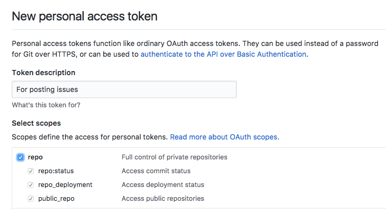

# micro-wishes-github

An easily-deployable microservice for collecting user feedback as GitHub issues.

## Deploy using [now](https://zeit.co/now)

```
now wishes-dev/micro-wishes-github -e GH_REPO=wishes-dev/testrepo GH_TOKEN=abc123
```

## Detailed instructions

- Sign in to the GitHub account that will post issues, e.g. `myapp-issuebot`.
- Go [here](https://github.com/settings/tokens/new) to generate a new personal access token.
- Enter a description, e.g. "For posting issues" and select the "repo" scope.



- Click "Generate token" and copy the token.

- Set up and account with now and install the now client. See [here](https://zeit.co/now) for details.
- Deploy the service with `now`. You must pass the following environment variables:
  - `GH_REPO`: The repo where issues will be posted, e.g. `myuser/myapp`.
  - `GH_TOKEN`: The access token you just created.

```
now wishes-dev/micro-wishes-github -e GH_REPO=myuser/myapp GH_TOKEN=abc123
```

- You're done! Copy the URL returned by `now`. This is the URL clients will use to access the service.

## Development

* Fork and clone this repo
* `yarn install`
* To run tests: `npm test`
